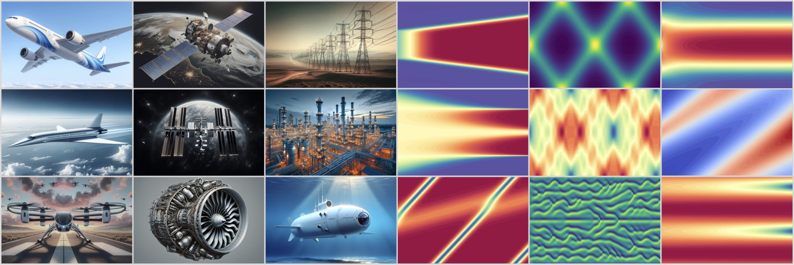

# controlgym 
[](https://pypi.org/project/controlgym/)

## Description 
`Controlgym` provides 36 industrial control environments and 10 infinite-dimensional PDE-based control problems with continuous, unbounded action and observation spaces that are inspired by real-world applications. This project supports the Learning for Dynamics & Control (L4DC) community, focusing on vital issues: convergence of reinforcement learning (RL) algorithms in policy development, stability, and robustness of learning-based controllers, and the scalability of RL algorithms to high and potentially infinite-dimensional systems. We provide a detailed description of `controlgym` in [this paper](https://arxiv.org/abs/2311.18736).

<p align="center">
  
</p>


## Installation
### Clone the Repository
To get started, clone the `controlgym` repository and navigate to folder:

```bash
git clone https://github.com/xiangyuan-zhang/controlgym.git
cd controlgym
```


<details>
<summary style="font-size: 20px;">Windows Installation</summary>
    
```bash
# Step 1: create and activate a virtual environment (Optional)
# Example a: using venv
py -3.10 -m venv controlgym-env
.\controlgym-env\Scripts\activate.bat
# Example b: using conda
conda create -n controlgym-env python=3.10
conda activate controlgym-env

# Step 2: install pytorch with cuda (optional)
pip3 install --upgrade pip
pip3 install torch --index-url https://download.pytorch.org/whl/cu121Install the repository

# Step 3: install the controlgym repository
# Example a: using pip
pip3 install -e .
# Example b: using poetry
poetry install

# Step 4: deactivate the virtual environment (Optional)
# For venv
.\controlgym-env\Scripts\deactivate.bat
# For conda
conda deactivate
```
</details>

<details>
<summary style="font-size: 20px;">Linux/MacOS Installation</summary>

```bash
# Step 1: Create and activate a virtual environment (Optional)
# Example a: using venv
python3.10 -m venv controlgym-env
source controlgym-env/bin/activate
# Example b: using conda
conda create -n controlgym-env python=3.10
conda activate controlgym-env

# Step 2: Install the controlgym repository
# Example a: using pip
pip3 install -e .
# Example b: using poetry
poetry install

# Step 3: Deactivate the virtual environment (Optional)
# For venv
deactivate
# For conda
conda deactivate
```
</details>


## Getting Started
Check out our code examples in this [Jupyter notebook file](./examples.ipynb).

## Reference
- Zhang, X., Mao, W., Mowlavi, S., Benosman, M., & Başar, T. (2023). [Controlgym: Large-Scale Control Environments for Benchmarking Reinforcement Learning Algorithms.](https://arxiv.org/abs/2311.18736) arXiv preprint arXiv:2311.18736.
  
```bibtex
@article{zhang2023controlgym,
    title = {Controlgym: Large-Scale Control Environments for Benchmarking Reinforcement Learning Algorithms},
    author = {Zhang, Xiangyuan and Mao, Weichao and Mowlavi, Saviz and Benosman, Mouhacine and Ba{\c{s}}ar, Tamer},
    journal = {arXiv preprint arXiv:2311.18736},
    year = {2023}
}
```